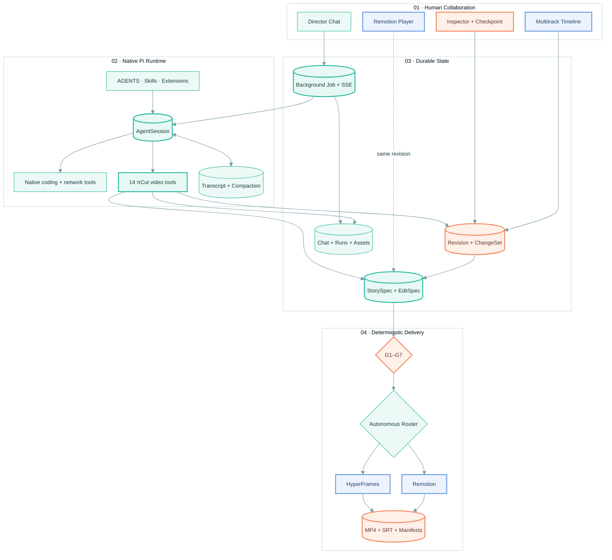
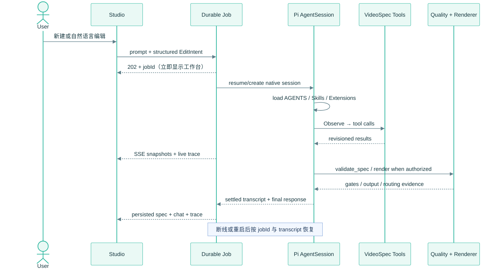

# πCut

> Agentic Video Compiler —— 原生 Pi AgentSession 负责自主规划，πCut 负责提供可审计的视频工具、人机协作工作台与确定性双引擎渲染。

πCut 将完整 Pi coding-agent runtime、结构化 `VideoSpec`、Remotion、HyperFrames、联网素材、TTS 与传统剪辑工作台组合在同一个本地应用中。Pi 保留原生会话、工具循环、Skills、Extensions、完整 transcript、自动压缩和 coding tools；视频框架不替模型做关键词规划，也不把自然语言编辑压缩成固定正则规则。

核心约定只有一条：视频状态以版本化 `VideoSpec` 为单一事实源。Agent、Timeline、Inspector、Canvas 与两个渲染引擎读写同一份工程状态，因此每次修改都可预览、撤销、校验和追溯。

## 当前已经跑通

- 原生运行时：`@earendil-works/pi-coding-agent@0.84.2/AgentSession`，不是单轮 completion，也不是 `pi-agent-core` 的受控套壳。
- 模型链路：复用本机 Pi 设置和登录态，当前实测为 `openai-codex/gpt-5.5 · medium → chatgpt.com/backend-api`。
- 原生资源栈：项目 Trust、`AGENTS.md`、`.agents/skills`、`.pi` 资源、Prompt Templates、Extensions、完整 coding tools、自动重试与 compaction。
- 不设置 Pi 工具白名单；14 个 πCut 视频工具作为领域能力附加到原生 `read / bash / edit / write` 等工具之上。
- 无关键词 Planner、无 regex Patch、无 `editorNote` 伪修改、无“远程失败后静默降级成本地模板”。
- 新建视频从专用空白生成画布开始，强制完成 `draft_storyboard`，不会载入 Transformer、云朵或其他缓存示例。
- UI 指代注入：`selectedSceneId`、播放头、Inspector Tab、选中字段、revision 会随指令进入本轮隐藏结构化上下文。
- 持久化后台 Agent Job：立即返回工作台，通过 SSE 显示实时工具轨迹；浏览器断线或进程中断后，从原生 transcript 与当前 VideoSpec 恢复。
- 多会话持久化：每个会话保存独立 VideoSpec、聊天、原生 Pi session、Agent runs、ChangeSet、审批状态、素材和输出。
- Remotion / HyperFrames / 自主路由三种选择；路由得分、依据、实际执行和 fallback 写入轨迹与 `RenderManifest.json`。
- 六类可渲染组件：自由组版的 `SceneCanvas`，以及 `TextHero`、`SplitScreen`、`DynamicChart`、`CaptionKaraoke`、`MediaBroll` 预制积木。
- `SceneCanvas` 支持最多 40 个文字、徽标、指标、公式、代码、图形、线条、图表、图像和粒子图层，每层独立坐标、样式、入场时序与镜头运动；Agent 不再被五种卡片模板限制。
- 视频、叠加、字幕、旁白、BGM 多轨时间轴；支持选择、定位、移动、裁切、分割、复制、删除、关键帧、效果、转场和撤销。镜头跨过相邻 clip 中心时会波纹重排，同步 StorySpec 与旁白分段，不会留下重叠的无效时间轴。
- Inspector 的 Scene / Style / Motion 直接修改真实消费字段；全局主题同步背景、表面、文字、强调色和全部镜头。
- 联网素材检索、本地资产化、可信下载域、许可与署名记录；当前支持 NASA、NOAA、Wikimedia 等来源路由。
- SiliconFlow TTS 作为独立可选服务，不参与 Pi 的规划模型链路。
- G1–G7 确定性质量门；失败时保留可见画布并允许 Agent 继续诊断/修复，不用“加载失败”替代编辑状态。
- 正式交付：MP4、SRT、VideoSpec、AssetManifest、RenderManifest 与视频 SHA-256。
- 项目级官方技能：9 个 HyperFrames Skills、12 个 Remotion Skills，ResourceLoader 实测 23 skills、0 diagnostics。

## 架构



### 原生会话与后台任务生命周期



## 快速启动

### 环境

- macOS 或 Linux；当前完整导出已在 macOS Apple Silicon 验证。
- Node.js 22，建议 `>= 22.19`。
- Chrome / Chromium、FFmpeg、FFprobe。
- 本机 Pi 已登录，并在 Pi 设置中选择可用 provider/model；πCut 不复制 OAuth token。

### 安装

```bash
npm install --ignore-scripts
cp .env.example .env.local
mkdir -p .picut/secrets
npm run dev
```

打开 [http://localhost:3000](http://localhost:3000)。

Pi 的 provider、model、thinking、auth 与 `httpProxy` 来自本机原生 Pi 配置。πCut 的网络初始化按以下顺序选择连接：

1. Pi 全局 `httpProxy`；
2. `PICUT_HTTP_PROXY`；
3. `HTTP_PROXY / HTTPS_PROXY`；
4. macOS 系统代理；
5. 直连。

可用下面的只读端点确认实际配置：

```bash
curl http://localhost:3000/api/config
```

期望看到类似：

```json
{
  "agentMode": "native-session",
  "runtime": "@earendil-works/pi-coding-agent@0.84.2/AgentSession",
  "provider": "openai-codex",
  "model": "gpt-5.5",
  "thinkingLevel": "medium",
  "fullPiResources": true
}
```

### 可选 TTS

SiliconFlow 只用于旁白合成。`.env.local` 仅保存 secret 文件路径，真实 Key 放在 Git 忽略的 `.picut/secrets/model-api-key`；不要放进 `NEXT_PUBLIC_*`、源码、Prompt、聊天、日志、截图或渲染资产。

```dotenv
PICUT_MODEL_BASE_URL=https://api.siliconflow.cn/v1
PICUT_MODEL_API_KEY_FILE=.picut/secrets/model-api-key
```

## 如何生成一个新视频

1. 打开左侧 Director 对话输入框下方的 `Sessions`。会话切换与新建都在对话工作流内，不再占用顶栏弹层。
2. 在“新建视频会话”里写完整 brief，例如：

   ```text
   生成一个 12 秒中文云朵形成科普视频，自己联网找真实云层素材，三段式叙事，信息卡和实拍交替，不要旁白
   ```

3. 点击“创建”后立刻进入新会话。此时看到的是该会话专属的“正在从零创建”画布，而不是任何缓存视频。
4. 工作台保持可用；左侧 `Agent 轨迹` 实时显示 Pi 读取技能、规划分镜、搜索素材、修改 VideoSpec、校验与渲染的过程。
5. 生成完成后，可以在 Timeline/Inspector 手调，也可以继续说：

   ```text
   第二幕换成实拍积雨云，把这个镜头缩小到 85%，标题改成“凝结成云”
   ```

6. 顶部 `Engine` 选择“自主路由”、Remotion 或 HyperFrames，点击 `Export MP4`。

生成失败不会换成示例项目，也不会谎报完成。Job 保留失败原因和原生 transcript，可点击“从原生 transcript 重试”。

## Studio 协作模型

### Chat → Native Pi → VideoSpec

普通聊天不经过关键词分类器。Pi 先观察完整工程和 UI 选区，自主决定读取技能、搜索资料、调用一个或多个领域工具、修改代码或运行质量门。对任何已经提交的 VideoSpec 修改，运行时守卫会要求本轮调用 `validate_spec`。

### UI → ChangeSet → Pi Context

- 点击 Timeline clip 会选中该 Scene，并把播放头移动到点击位置对应时间。
- Clip 最短 0.1 秒；Duration 控件的最小值也是 0.1 秒，不允许先拖到 0 再报错。
- Timeline 支持移动、裁切、分割、复制、删除和波纹重排。
- Inspector Style/Motion 写入真实 `props / transform / effects / transition / keyframes` 字段。
- UI 手调产生原子 ChangeSet；下一轮 Pi 会看到新的 revision、选中 Scene、播放头和 Inspector 上下文。
- 生成或联网搜索时，画布、播放、Timeline 和 Inspector 保持可用。

### Human checkpoint

新增、删除、重排或整体重构 Scene 属于结构变更。Pi 可以生成完整提案，但必须等待 Studio 中的批准/拒绝。普通文本、颜色、位置、动画和时长调整可以直接提交。

## 原生 Pi 能力与视频工具

Pi 的原生 coding tools 没有被 πCut allowlist 裁剪。它可以按项目权限读取代码、编辑实现、执行命令、联网查资料和加载 Skills/Extensions。πCut 另外提供以下强类型视频工具：

| 工具 | 能力 | 约束 |
|---|---|---|
| `get_video_spec` | 观察完整 VideoSpec、质量门、待审批项与 UI 选区 | 编辑前优先使用 |
| `create_project` | 用户明确要求时重置项目 | 必须有本轮明确授权 |
| `draft_storyboard` | 从 brief 生成原创 StorySpec/EditSpec | 新建会话必须执行 |
| `update_scene` | 修改单镜头文字、旁白、组件、时序、样式、Motion、效果 | 支持 UI 当前 Scene 指代 |
| `apply_video_patch` | 修改全局主题、轨道、资产、音频或批量字段 | 拒绝 `editorNote` 与系统字段 |
| `insert_scene` | 插入完整 StoryScene/EditScene | 结构审批 |
| `reorder_scenes` | 完整镜头重排与波纹对齐 | 结构审批 |
| `delete_scene` | 同步删除 Story/Edit 镜头 | 结构审批 |
| `resolve_change` | 批准或拒绝待处理 ChangeSet | 只接受明确用户决定 |
| `validate_spec` | G1–G7 校验与确定性自动修复 | 修改后必跑 |
| `search_media` | 搜索、下载、许可校验、署名、本地化 | 不把凭据发给素材源 |
| `synthesize_narration` | 分镜 TTS、时长校准、淡入淡出、多轨写入 | 使用独立服务端 Key |
| `render_preview` | 快速预览渲染 | 质量门通过后执行 |
| `render_final` | 正式 MP4 五件套 | 当前轮明确授权后执行 |

## 项目级 Skills

技能安装在 `.agents/skills/`，随仓库工作区被 Pi 的 `DefaultResourceLoader` 发现；不需要写入全局 `.pi/skills`。`SettingsManager` 只对 πCut 当前工作区启用 Project Trust，不会改变用户全局 Trust 配置。

当前安装：

- HyperFrames：`hyperframes`、animation、audio、cli、core、creative、keyframes、registry、media-use。
- Remotion：best-practices、captions、create、docs、interactivity、maps、markup、multimedia、render、saas、studio、upgrade。

重装官方技能：

```bash
npx skills add heygen-com/hyperframes
npx skills add remotion-dev/skills
```

技能源码属于 Agent 知识与参考实现，独立安全审查，不参与 πCut 应用 ESLint/TypeScript 构建。宿主强制设置 `HYPERFRAMES_NO_TELEMETRY=1`。

## VideoSpec

```json
{
  "schemaVersion": "1.0.0",
  "revision": 2,
  "project": {"id": "cloud-science-12s", "targetDurationMs": 12000},
  "canvas": {"width": 1920, "height": 1080, "fps": 30},
  "style": {"themeRef": "picut-nature", "tokens": {"background": "#071522"}},
  "storySpec": {"scenes": [{"id": "scene-01", "purpose": "建立问题"}]},
  "editSpec": {
    "tracks": [
      {"id": "video-main", "kind": "video"},
      {"id": "caption-main", "kind": "caption"},
      {"id": "audio-narration", "kind": "audio"}
    ],
    "scenes": [
      {
        "id": "scene-01",
        "startFrame": 0,
        "durationFrames": 120,
        "component": "SceneCanvas",
        "props": {
          "background": {"type": "radial", "colors": ["#071522", "#102A3D"]},
          "camera": {"startScale": 1, "endScale": 1.06, "panX": -2, "panY": 1},
          "layers": [
            {"id": "title", "type": "text", "x": 8, "y": 10, "width": 58, "height": 18, "content": "云为什么会出现？"},
            {"id": "droplets", "type": "particles", "x": -8, "y": 20, "width": 72, "height": 60, "content": "24"}
          ]
        },
        "transform": {"x": 0, "y": 0, "scale": 1, "rotation": 0, "opacity": 1}
      }
    ]
  },
  "provenance": {"agentKernel": "@earendil-works/pi-coding-agent@0.84.2/AgentSession"}
}
```

VideoSpec 是工程真相；Remotion TSX 和 HyperFrames HTML 是可重新生成的编译/渲染产物。`SceneCanvas` 同时编译到 Remotion 帧级动画与 HyperFrames DOM/GSAP 时间线；内容图层留在安全区，图形/粒子允许进入出血区，摄像机运动不会裁掉标题。

## 双引擎与自主路由

自主路由综合场景组件、`SceneCanvas` 图层类型/数量、素材类型、音频复用、关键帧密度和引擎约束打分，输出：

- `selected`：计划选择；
- `scores` 与 `confidence`；
- `reasons`：可读依据；
- `fallback`：备用引擎；
- `executed`：实际执行；
- `fallbackApplied / fallbackReason`。

这些数据同时进入会话 Agent 轨迹和 RenderManifest。任一引擎失败时可以自动切到备用引擎，不会把 fallback 隐藏成首选成功。

产物目录：

```text
public/renders/<project>-r<revision>-<backend>-<mode>/
├── <slug>.mp4
├── subtitles.srt
├── VideoSpec.json
├── AssetManifest.json
└── RenderManifest.json
```

## G1–G7

| Gate | 检查 | 行为 |
|---|---|---|
| G1 | VideoSpec Schema 与基础类型 | 阻断结构错误 |
| G2 | Story/Edit 语义引用与稳定 Scene ID | 阻断不完整契约 |
| G3 | 帧边界、重叠、空隙、总时长 | 自动修复确定性问题，否则阻断 |
| G4 | 素材 src、可用性、许可与本地化 | 阻断不可用资产 |
| G5 | 组件注册与 Props 合同 | 阻断不可渲染组件 |
| G6 | 旁白分段、BGM、音画同步准备度 | 无音频需求时仅提醒 |
| G7 | revision、provenance 与交付完整性 | 阻断错误版本导出 |

质量失败不会让画布消失。系统保留上一个可见 revision，并允许 Agent 观察诊断、自动修复和重新校验。

## 持久化与 API

本地数据：

```text
.picut/
├── projects/       # VideoSpec、聊天、ChangeSet、Agent runs
├── jobs/           # 可恢复后台任务状态与事件
├── pi-sessions/    # 原生 JSONL transcript、分支与 compaction
└── secrets/        # Git 忽略的独立服务密钥
```

| Method | Route | 用途 |
|---|---|---|
| `GET/POST` | `/api/agent/jobs` | 列出或创建持久化 Agent Job |
| `GET/POST` | `/api/agent/jobs/:jobId` | 快照或失败重试 |
| `GET` | `/api/agent/jobs/:jobId/events` | SSE 实时状态与断线重连 |
| `POST` | `/api/agent/run` | 兼容用同步原生 AgentSession 调用 |
| `GET/POST` | `/api/projects` | 会话列表 / 创建空白会话并排队生成 |
| `GET/PATCH/DELETE` | `/api/projects/:id` | 项目读取、重命名、可恢复归档 |
| `POST` | `/api/projects/:id/changesets` | UI 原子 ChangeSet |
| `POST` | `/api/projects/:id/undo` | 撤销 |
| `POST` | `/api/projects/:id/audio/synthesize` | 旁白合成与音轨写入 |
| `POST` | `/api/projects/:id/media/enrich` | 素材搜索与本地化 |
| `POST` | `/api/projects/:id/render` | 指定/自主路由渲染 |
| `GET` | `/api/config` | 非敏感能力对账 |

## 安全边界

- 不读取、展示或外传 `.picut/secrets`、`.env.local` 值、本机 Pi OAuth/token 或其他凭据。
- 不把凭据写入 Prompt、工具参数、transcript、日志、素材元数据、截图或外部请求。
- Pi 创作/编码能力不做 allowlist 裁剪；密钥访问、不可恢复删除、最终发布/上传和付费外部动作仍受明确授权约束。
- 结构性视频修改走 Human checkpoint；普通可逆编辑不打断 Agent 规划。
- 项目写入使用项目级队列与临时文件原子替换；聊天和 Agent run 按稳定 ID 幂等 upsert。
- HyperFrames/media-use telemetry 在宿主层关闭；技能的外联示例不会获得模型/TTS密钥。
- RenderManifest 固定 revision、规范摘要、路由证据与 MP4 SHA-256。

## 验证

```bash
npm run typecheck
npm test
npm run lint
npm run build
npm run verify
```

真实本地端到端验收应覆盖：

- `/api/config` 显示 `native-session / openai-codex / gpt-5.5 / medium`；
- 从 revision 0 专用生成画布创建全新会话；
- 原生 Pi 自主读取项目 Skill；
- `draft_storyboard → search_media → validate_spec`；
- 创建与后续编辑复用同一个 `sessionId`；
- UI 指代更新真实 `transform / props` 字段；
- Job 的 SSE、持久化、失败重试和恢复；
- G1–G7；
- 自主路由、正式 MP4 和五件套清单；
- `git diff --check` 与秘密扫描。

## 目录

```text
src/
├── app/api/
│   ├── agent/jobs/            # 持久化 Job、快照、重试、SSE
│   └── projects/              # 会话、音频、素材、渲染、ChangeSet
├── components/studio/         # Chat / Canvas / Timeline / Inspector
├── lib/
│   ├── agent/                 # Native AgentSession、网络、Jobs、14 工具
│   ├── audio/                 # TTS、分段、淡入淡出、多轨
│   ├── project/               # 原子持久化、revision、审批、归档
│   ├── render/                # Remotion/HyperFrames Adapter 与路由
│   ├── research/              # 可追溯素材检索
│   └── video-spec/            # Schema、Patch、repair、G1–G7
├── remotion/                  # 组件与帧级 Composition
├── app/globals.css            # Studio 基础视觉系统
└── app/nle.css                # 多轨、Sessions、轨迹与创建态
```

## License

仓库尚未指定开源许可证。正式公开分发前，请由项目所有者选择并补充 `LICENSE`。
