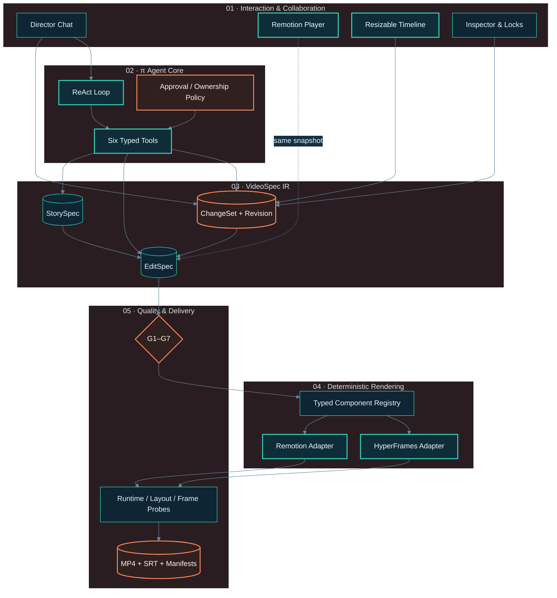
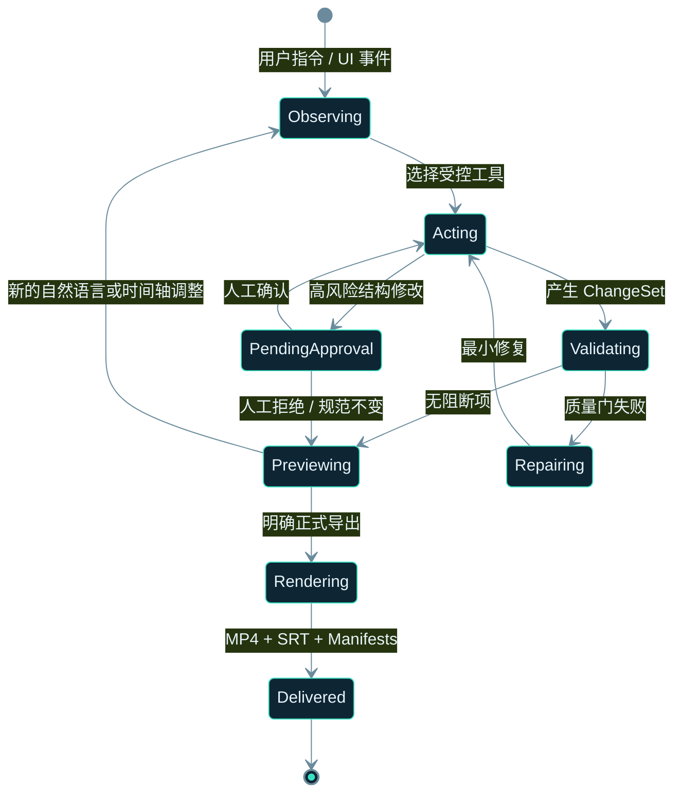

# πCut

> Agentic Video Compiler —— 以 VideoSpec 为单一事实源，将 π Agent、ReAct、Remotion、HyperFrames 和可视时间轴组合成一套人机协同代码视频系统。

πCut 不让模型直接生成难以维护的 TSX 或 HTML，而是让 Agent 通过受约束工具生成和修改版本化 `VideoSpec`。同一份规范可被 Remotion 与 HyperFrames 独立编译、预览和导出；用户也可在 Chat、Canvas、Timeline 和 Inspector 中修改同一份状态。

## 已跑通的垂直切片

- π Agent 真实运行时：`@earendil-works/pi-agent-core` + `@earendil-works/pi-ai`。
- SiliconFlow OpenAI-compatible 模型调用，支持主模型和故障回退。
- 完整 ReAct 循环：Observe → Tool Call → Tool Result → Validate → Reply。
- StorySpec + EditSpec 双层 VideoSpec，具备 Schema、revision、provenance 和稳定 Scene ID。
- 六个受控 Agent 工具：建项、分镜、Patch、校验、预览渲染、正式导出。
- 四个强类型原子组件：`TextHero`、`SplitScreen`、`DynamicChart`、`CaptionKaraoke`。
- Remotion 和 HyperFrames 双引擎真实 1080p MP4 导出。
- Chat + Remotion Player + 可拖拽分镜时间轴 + Inspector 组成的暗色编辑工作台。
- UI 修改、Agent 修改和时间轴拖动统一提交为 ChangeSet。
- 乐观版本控制、字段锁、镜头锁、撤销、冲突拒绝和人工审批。
- G1–G7 质量门、SRT、VideoSpec、AssetManifest 和 RenderManifest 交付包。
- 单元测试、双引擎契约测试、真实 Agent 调用和 Chrome 端到端测试。

## 系统架构



### 人机协同状态流



## 快速启动

### 环境要求

- macOS / Linux；当前完整导出在 macOS Apple Silicon 验证。
- Node.js 22，建议 `>= 22.19`。
- Chrome / Chromium。
- FFmpeg 和 FFprobe。

### 安装与运行

```bash
npm install --ignore-scripts
cp .env.example .env.local
mkdir -p .picut/secrets
npm run dev
```

打开 [http://localhost:3000](http://localhost:3000)。

`.env.local` 是服务端本地配置，已被 Git 忽略。它只保存 secret 文件路径；请用本地 secret manager 或编辑器把模型密钥写入 `.picut/secrets/model-api-key`。不要将密钥放入 `NEXT_PUBLIC_*`、源码、Prompt、日志、截图或渲染资产。

```dotenv
PICUT_AGENT_MODE=auto
PICUT_MODEL_PROVIDER=siliconflow
PICUT_MODEL_BASE_URL=https://api.siliconflow.cn/v1
PICUT_MODEL_ID=<model-id>
PICUT_MODEL_FALLBACK_IDS=<fallback-a>,<fallback-b>
PICUT_MODEL_API_KEY_FILE=.picut/secrets/model-api-key
PICUT_CHROME_EXECUTABLE=/absolute/path/to/chrome
```

`PICUT_AGENT_MODE` 支持：

- `auto`：优先远程模型，失败时回退到本地确定性 Planner。
- `remote`：只使用远程模型，错误直接返回。
- `local`：不请求外部模型，用于测试和离线开发。

## Studio 交互

### Chat → Agent

可直接输入：

```text
把第 3 幕的图表改成蓝色，并延长到 12 秒
```

Agent 将调用 `apply_spec_patch`，观察工具结果，再调用 `validate_spec`。前端只接收已持久化的最新 revision。

### Timeline → VideoSpec → Agent

- 选择任一 Scene，拖动左侧手柄调整入点。
- 拖动右侧手柄调整出点，后续 Scene 自动级联平移。
- 拖动以 0.5 秒为吸附精度，单 Scene 最短 3 秒。
- 松手时才提交一个原子 ChangeSet，并在 Director 中生成 `UI → VideoSpec → Agent` 事件。

### Human checkpoint

删除、新增、重排或重构 Scene 属于高风险操作。Agent 只能暂存提案，Studio 会显示待确认卡片。确认前 revision 和时间轴不变；拒绝后提案进入审计记录但不改写 VideoSpec。

## Agent 工具契约

| 工具 | 职责 | 风险策略 |
|---|---|---|
| `create_project` | 创建或明确重置项目 | 仅用户明确要求时调用 |
| `draft_storyboard` | 观察 StorySpec / EditSpec 并生成分镜 | 不运行任意代码 |
| `apply_spec_patch` | 自然语言转受审计 ChangeSet | 尊重字段锁与镜头锁 |
| `validate_spec` | 运行 G1–G7 确定性质量门 | 任一阻断项拒绝渲染 |
| `render_preview` | 导出可快速检查的预览产物 | 校验通过后才执行 |
| `render_final` | 生成正式成片和五件套 | 必须是当前用户明确导出意图 |

## VideoSpec 核心契约

```json
{
  "schemaVersion": "1.0.0",
  "revision": 0,
  "project": {
    "id": "transformer-60s",
    "targetDurationMs": 60000,
    "renderSeed": 314159
  },
  "canvas": {"width": 1920, "height": 1080, "fps": 30},
  "storySpec": {"scenes": ["semantic scene contracts"]},
  "editSpec": {
    "scenes": [
      {
        "id": "scene-03",
        "startFrame": 570,
        "durationFrames": 360,
        "backend": "either",
        "component": "DynamicChart",
        "props": {"kicker": "STEP 01", "title": "相关性", "chartType": "bar", "labels": ["小猫"], "values": [92], "highlightIndex": 0, "formula": "QKᵀ / √dₖ"},
        "locks": {"owner": "shared", "fields": [], "locked": false}
      }
    ]
  },
  "provenance": {"agentKernel": "@earendil-works/pi-agent-core@0.84.2"}
}
```

VideoSpec 是持久化的工程真相；Remotion TSX 和 HyperFrames HTML 都是可重新生成的编译产物。

## 双引擎渲染

### 通过 Studio

1. 在顶部 `Engine` 中选择 Remotion 或 HyperFrames。
2. 确认 `G1–G7 Ready`。
3. 点击 `Export MP4`。
4. 完成后在右下角下载 MP4 或查看 RenderManifest。

### 通过本地脚本

先启动 `npm run dev`，然后在另一个终端调用与 Studio 相同的渲染 API：

```bash
npm run render:demo -- remotion preview
npm run render:demo -- remotion final
npm run render:demo -- hyperframes final
```

产物位于：

```text
public/renders/<project>-r<revision>-<backend>-<mode>/
├── <slug>.mp4
├── subtitles.srt
├── VideoSpec.json
├── AssetManifest.json
└── RenderManifest.json
```

`public/renders`、`output` 和 `.picut` 均为本地运行产物，默认不提交到 Git。

## G1–G7 质量门

| Gate | 检查内容 | 行为 |
|---|---|---|
| G1 | VideoSpec Schema 和基础类型 | 错误阻断 |
| G2 | StoryScene / EditScene 语义引用完整性 | 错误阻断 |
| G3 | 帧边界、重叠、空隙和最大时长 | 错误阻断，空隙警告 |
| G4 | 素材 src 与资产契约 | 错误阻断 |
| G5 | 组件注册与四类 Props Schema | 错误阻断 |
| G6 | 旁白、BGM 和视听对齐准备度 | 当前 Demo 无音轨时给出警告 |
| G7 | 交付版本与清单完整性 | 错误阻断 |

HyperFrames 正式导出前还经过其原生 `lint + runtime + layout + contrast` 门禁；Remotion 通过编译、Player 预览、服务端渲染和多时间点帧抽检验收。

## 验证命令

```bash
npm run typecheck
npm run lint
npm test
npm run build
npm run verify
```

启动开发服务后执行真实 Chrome E2E：

```bash
node scripts/e2e.mjs
```

E2E 覆盖：

- 首屏、Player 和 6 个 Timeline Clip。
- 选中 Scene 与 Player seek 同步。
- 拖动出点、级联时间轴、ChangeSet 和撤销。
- 结构删除提案、审批卡和人工拒绝。
- Inspector 颜色修改。
- 远程 Agent 调用与局部 DSL Patch。
- G1–G7 状态、revision 变化、撤销恢复。
- console error、page error 和 request failure 零容忍检查。

## API

| Method | Route | 用途 |
|---|---|---|
| `POST` | `/api/agent/run` | 运行一轮 π Agent / ReAct |
| `GET` | `/api/config` | 只返回非敏感运行配置 |
| `GET` | `/api/projects/:id` | 项目、历史、变更和质量报告 |
| `POST` | `/api/projects/:id/changesets` | 提交人类 UI ChangeSet |
| `POST` | `/api/projects/:id/undo` | 恢复前一快照并生成新 revision |
| `POST` | `/api/projects/:id/render` | 调用双引擎预览/正式导出 |

## 目录结构

```text
src/
├── app/
│   ├── api/                    # Agent、项目、ChangeSet、渲染 API
│   └── globals.css             # Studio 视觉系统
├── components/studio/
│   ├── Studio.tsx             # Chat / Canvas / Timeline / Inspector
│   └── RemotionPreview.tsx    # 客户端动态 Player
├── lib/
│   ├── agent/                  # π Agent、ReAct、指令转 Patch
│   ├── project/                # revision、快照、撤销、待审批状态
│   ├── render/                 # Remotion / HyperFrames Adapter
│   └── video-spec/             # Schema、编译、Patch、G1–G7
└── remotion/
    ├── components/             # 四个原子视频组件
    └── VideoComposition.tsx    # 帧级编排
```

## 密钥与渲染安全

- `.env.local` 被 `.gitignore` 的 `.env*` 规则排除，且只保存 secret 文件路径；真实值位于同样被忽略的 `.picut/secrets/model-api-key`。
- 模型配置模块仅在服务端加载；`/api/config` 不返回密钥。
- HyperFrames 子进程使用显式最小环境白名单，不继承 `PICUT_MODEL_*` 或其他业务密钥。
- Agent 只能调用六个带 Schema 的领域工具，没有任意 Shell 或生产文件写入权限。
- 最终渲染前固定 VideoSpec revision，RenderManifest 记录规范摘要和视频 SHA-256。
- 高风险结构操作必须在另一轮人类确认后提交。

## 当前边界与演进接口

当前默认案例是 6 Scene、60–62 秒的 Transformer 知识解说。它使用文本旁白节奏，未绑定真实旁白和 BGM，因此 G6 保留可见警告，不伪装为已完成的音频链路。

已预留的下一阶段接口包括：

- ASR / Whisper 词级时间戳与字幕卡点。
- Scene Checkpoint DAG 与长任务恢复。
- 品牌、组件、用户偏好的显式 Memory。
- 知识解说、数据报表、产品发布等 Domain Pack。
- 动态组件隔离沙箱、签名 Manifest 与组件市场。
- 队列、Scene 级缓存、云渲染、多租户与可观测性。

## License

仓库尚未指定开源许可证。在正式对外发布前，请由项目所有者选择并补充 LICENSE。
